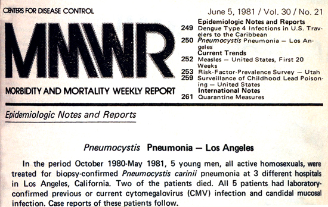
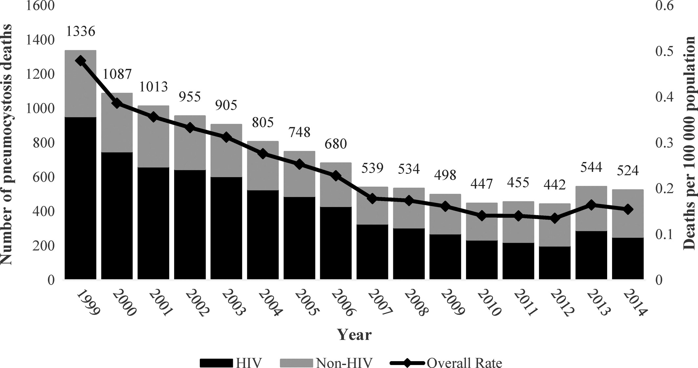

```{r setup, include=FALSE}
options(htmltools.dir.version = FALSE)
xaringan::summon_remark()
```

## Disclosures <hr/>

- No conflicts of interest.

- Too many topics covered.

- May contain GIFs.

---

Notes from John:

a.       "Incidence rate" crept into the notes and lecture (I missed that again! sorry!).  I think we need to remove this term and stick with cumulative incidence and incidence density.  "Incidence rate" is still confusing (even to me because I think of it as just the 'colloquial' version of either.)

b.       It would be good to have a separate slide on 'person time' and calculating person time.

c.       I think we should use the term "Risk Difference" instead of "Absolute risk reduction."  This should always be "Ie-Iu" but in one of the examples in the lecture, it's reversed and it's presented as "Iu-Ie" which was confusing to them.  We could also define both terms and say RD=Ie-Iu and then absolute risk reduction has to do with the way in which the question is phrased (i.e., improvement is a good outcome or adverse event where the outcome is bad).

d.       Calculating annual cumulative incidence on slides 23-24; I think the answer given during lecture was 0.3 but I think it should actually be 0.15.  This was confusing to them (and me).


---

## Learning Objectives <hr/>

- How we measure: describe types of data and data distributions.

- Measures of disease occurrence: use population data in the description of health and disease.

- Key concepts -- explain the meaning of:

    - prevalence
    - incidence (<ins>warning</ins>: multiple types)
    - relative risk (RR)
    - odds ratio (OR)

- Implementation: calculate prevalence, incidence, RR, and OR from study data (2x2 tables!).


---

## Why Do I Care? ... <hr/>

- Why use these tools (prevalence, incidence, RR, OR)?

     - inform differential diagnoses & counsel patients (<ins>your job</ins>)  
     
     - design public health interventions & direct new diagnostics/therapies (society!)   
     
     - understand distributions and determinants of diseases (science!)  


---

## ... What Do I Need to Know for the Test? <hr/>

- How to use these tools:

     - precise definitions 
     (e.g., RR vs OR, cumulative incidence vs incidence density)  
     
     - a bit of arithmetic  


---

## A case from 1981... <hr/>


---

background-image: url(gifs/magnum_pi.gif)
background-size: cover


???

Image credit: [GIPHY](https://gph.is/1AUItZt)


---

## A case from 1981... <hr/>  

- 36-year-old man presents with a 4-month history of fever, dyspnea, and cough.


---

background-image: url(figs/hiv_timeline_mmwr_1981.png)
background-size: contain


???

Image credit: [MMWR](https://www.hiv.gov/hiv-basics/overview/history/hiv-and-aids-timeline)


---

## MMWR June 5, 1981 <hr/>

.pull-left[
_All the above observations suggest the possibility of a <mark>cellular-immune dysfunction related to a common exposure that predisposes individuals to opportunistic infections such as pneumocystosis and candidiasis</mark>. Although the role of CMV infection in the pathogenesis of pneumocystosis remains unknown, the possibility of_ P. carinii _infection must be carefully considered in a differential diagnosis for previously healthy homosexual males with dyspnea and pneumonia._

\- Gottlieb MS et al <ins>MMWR</ins> 1981
]

.pull-right[

]


---

## A case from 1981... _Pneumocystis_ pneumonia? <hr/>

- 36-year-old man presents with a 4-month history of fever, dyspnea, and cough.

- What do you want to know and why?  

    - history
    - vital signs
    - physical exam
    - laboratory test values
    - radiology  

- What is his diagnosis? Does he have _Pneumocystis_ pneumonia?


---

## A case from 1981... _Pneumocystis_ pneumonia? <hr/>

- Differential diagnosis must be grounded in understanding:

    - distributions of disease: we'll learn about **prevalence** & **incidence**  
    
    - determinants of disease: we'll learn **2x2 tables** to relate exposures and outcomes  
  
<br/>
  
- In 1981, _Pneumocystis_ was known to be a low <ins>prevalence</ins> disease.

- New data would show an increasing <ins>incidence</ins>.
  
<br/>
  
<p style="text-align: center;"> <mark>Note: in infectious diseases, the differential is always evolving</mark> </p>


---

## A case from 1981... _Pneumocystis_ pneumonia? <hr/>

- Does our patient have _Pneumocystis_ pneumonia?

- How is the distribution of _Pneumocystis_ pneumonia changing?

- What are the determinants of _Pneumocystis_ pneumonia?
  
<br/>
  
<p style="text-align: center;"> <mark>Note: questions depend on <strong>dichotomous</strong> definition of disease (yes/no <em>Pneumocystis</em>)</mark> </p>
  


---
class: inverse, center, middle

# Data Types & Data Distributions


---

## Data Types <hr/>

- Vital signs and physical exam:

    - temperature (degrees) - continuous
    - heart / respiratory rate (beats or breaths / min) - continuous
    - oxygen saturation (%) - continuous

- Laboratory values:

    - white blood cell count (cells / uL) - continuous
    - *if it weren't 1981... CD4 cell count (cells / uL) and HIV viral load (copies / mL) - continuous*

- Radiology:

    - ground glass - dichotomous


---

## Data Types <hr/>

- __Dichotomous__: history of diabetes, history of breast cancer; survival, pneumonia, MI

- __Continuous__: age, height, weight, blood pressure; probability of treatment result

- __Nominal__: race, ethnicity, state of residence

- __Ordinal__: age category, weight category; patient satisfaction
  
<br/>
  
<p style="text-align: center;"> <mark>Note: in medicine, we regard diagnoses and clinical decisions as dichotomous</mark> </p>
  
  
---

## Characterizing Continuous Data: Normal <hr/>

- "Normally distributed" data are well characterized by their mean and standard deviation.

    - **mean ( $\mu$)**:
$$\mu=\frac{1}{N}\sum_{i=1}^Nx_i$$

    - **standard deviation (SD or $\sigma$)**:
$$\sigma=\sqrt{\frac{1}{N}*\sum_{i=1}^N(x_i - \mu)^2}$$

---

## Characterizing Continuous Data: Normal <hr/>

- What makes standard deviation greater?

```{r continuous_data, echo=FALSE, warning=FALSE, message=FALSE, fig.height=4.5, fig.width=12, fig.align='center', fig.retina=2}

library(tidyverse)

tibble(`Mean = 90%, SD = 1%` = rnorm(n = 1000, mean = 0.9, sd = 0.01), `Mean = 90%, SD = 3%` = rnorm(n = 1000, mean = 0.9, sd = 0.03)) %>%
  gather(key = sd_type, value = `O2 Saturation`) -> pcp_o2

tibble(`O2 Saturation` = with(pcp_o2, seq(min(`O2 Saturation`), max(`O2 Saturation`), length = 100))) %>%
  mutate(`Mean = 90%, SD = 1%` = dnorm(`O2 Saturation`, mean = 0.9, sd = 0.01),
         `Mean = 90%, SD = 3%` = dnorm(`O2 Saturation`, mean = 0.9, sd = 0.03)) %>%
  gather(key = sd_type, value = norm_density, -`O2 Saturation`) -> pcp_norm

pcp_o2 %>%
  ggplot(data = .) + 
  geom_histogram(aes(x = `O2 Saturation`, y = ..density.., fill = sd_type), colour = "black") +
  #geom_density(aes(x = `O2 Saturation`), colour = "black", fill = NA, kernel = 'gaussian', weight = 2) +
  geom_line(data = pcp_norm, aes(x = `O2 Saturation`, y = norm_density), colour = "black", size = 2) +
  facet_wrap(facets = ~ sd_type, ncol = 2) +
  scale_x_continuous(limits = c(0.8,1)) +
  theme_classic() +
  theme(legend.position = 'none', line = element_line(colour = "black"), text = element_text(size = 22), plot.title = element_text(size = 22)) +
  labs(title = "1000 Subjects with Pneumocystis*", x = "Oxygen Saturation (%)", y = "Count")

```

.footnote[[*] Data made up.]

---

## Reflection Question <hr/>

What makes standard deviation greater?

- (A) More subjects?

- (B) Higher mean value?

- (C) Higher maximum value?

- (D) Greater difference between extreme and mean values? 


---

## Characterizing Continuous Data: Skewed or Uniform <hr/>

- “Non-parametric” data have a mean and standard deviation, but these parameters do NOT characterize the data well.

- For uniform or skewed data, we prefer to use **median** and **interquartile range (IQR)** to describe the distribution of a continuous variable because these are less affected by extreme values. 
  
- For normal data, mean and median have the same value.  


---

## Characterizing Continuous Data: Skewed or Uniform <hr/>

```{r skewed_data, echo=FALSE, warning=FALSE, message=FALSE, fig.height=4.5, fig.width=12, fig.align='center', fig.retina=2}

library(tidyverse)

tibble("Uniform" = runif(n = 1000, min = 0.85, max = 0.95), "Skewed" = rbeta(1000,9,1)) %>%
  gather(key = dis_type, value = o2_sat) -> pcp_skew_o2

pcp_skew_o2 %>%
  group_by(dis_type) %>%
  summarise(median = median(o2_sat, na.rm = TRUE),
            mean = mean(o2_sat, na.rm = TRUE)) %>%
  ungroup() -> pcp_dist

pcp_skew_o2 %>%
  ggplot(data = .) + 
  geom_histogram(aes(x = o2_sat, fill = dis_type), colour = "black", binwidth = 0.005) +
  #geom_density(aes(x = `O2 Saturation`), colour = "black", fill = NA, kernel = 'gaussian', weight = 2) +
  #geom_line(data = pcp_norm, aes(x = `O2 Saturation`, y = norm_density), colour = "black", size = 2) +
  geom_vline(data = pcp_dist, aes(xintercept = median), colour = "blue", size = 2) +
  geom_vline(data = pcp_dist, aes(xintercept = mean), colour = "black", size = 2) +
  facet_wrap(facets = ~ dis_type, ncol = 2) +
  scale_x_continuous(limits = c(0.8,1)) +
  theme_classic() +
  theme(legend.position = 'none', line = element_line(colour = "black"), text = element_text(size = 22), plot.title = element_text(size = 22), plot.subtitle = element_text(size = 22)) +
  labs(title = "1000 Subjects with Pneumocystis*", subtitle = "(Blue Line = Median & Black Line = Mean)", x = "Oxygen Saturation (%)", y = "Count")


```

.footnote[[*] Data made up.]


---

## Characterizing Continuous Data <hr/>

- Median and mode depend on ranking the values:

    - median is the “middle value” when data are ordered
    - mode is most frequently occurring value.

- Interquartile range (IQR) also depends on ranking the values:

    - the first quartile is the "middle" value of the first half of the ordered set
    - the third quartile is the "middle" value of the second half of the ordered set
    - IQR is the range of values between first and third quartiles


---

## Reflection Question <hr/>

Which is least affected by outliers?

- (A) Mean?

- (B) Median?

- (C) Mode?


---

## How to Characterize Continuous Data <hr/>

- Pair a measure of central tendency with a measure of dispersion:

    - mean and SD   
    
    - median and IQR  

- In doing so, account for <ins>uncertainty</ins> in measures.  


---

## Dichotomizing Continuous Data <hr/>

- Using a threshold to transform continuous data into dichotomous data, means losing information about uncertainty.

- This is on top of the fundamental uncertainty we face with any epidemiologic measure: does the measured population represent the population of interest?

- Remember the diagnosis lecture: what threshold of oxygen saturation diagnoses _Pneumocystis_ pneumonia?
  
  
  
---

## Dichotomania <hr/>

- As we discuss prevalence, incidence, RR, and OR, we will focus on <ins>dichotomous</ins> exposures and outcomes.

- Remember -- with dichotomous data:

    - information is lost
    - misclassification is common

- But we're doing it anyway &#x1F600; ... why?

- Medicine focuses on dichotomous diagnostic and treatment decisions.


---
class: inverse, center, middle

# Measures of Disease Occurrence


---

## A case from 1981... _Pneumocystis_ pneumonia? <hr/>

- How common is _Pneumocystis_ pneumonia?


---

## Prevalence <hr/>

--

- How common is _Pneumocystis_ pneumonia?

--

- Prevalence: 

    - number with the disease / number in specified population
    - **point prevalence**: at a specific point in time
    - **period prevalence**: during a given period (e.g., 12-month prevalence)
    - a proportion (unitless, ranges from 0-1)
    - numerator includes all people who have the disease, both new and ongoing cases
    - represents a cross-sectional “snapshot” of the population


---

## Prevalence of _Pneumocystis_ pneumonia <hr/>

- In 1967, CDC became the sole supplier of pentamidine in the United States and began collecting data on cases of PCP:

    - period prevalence published in 1974*: 579 cases (194 confirmed) over 3 years.
    - what’s the denominator?
    - what’s the prevalence?

- __Point prevalence__ of _Pneumocystis_ would be vanishingly small given limited duration of disease.

- In 1967, even the __period prevalence__ is very small.

.footnote[[*] Walzer PD et al _Annals Int Med_ 1974]


---

## Prevalence <hr/>

- Prevalence is **NOT** the same as risk.

- Prevalence numerator includes all people who have the disease, both new and ongoing cases, so represents a cross-sectional “snapshot” of the population. 

- Prevalence does **NOT** estimate the risk of developing the disease because prevalence does not fully account for time (are the measured cases old cases or new cases?).


---

## Reflection Question <hr/>

How can an infection have high prevalence if it occurs infrequently?

- (A) the infection is rapidly fatal

- (B) the infection rapidly resolves

- (C) a few children get the infection every year, but the infection persists for the rest of their lives

- (D) the infection results in lifelong protective immunity


---

background-image: url(figs/nejm_combined.png)
background-size: contain


---

## Incidence <hr/>

- Among MSM, _Pneumocystis_ pneumonia is occurring more frequently...

- Incidence: occurrence of new cases over a given period of time:

    - **cumulative incidence**: # new cases / # population at risk @ start time interval
    - **incidence density**: # new cases / person-time at risk (more precise)

---

## Notes on Cumulative Incidence <hr/>

- Cumulative incidence:

    - must specify population consisting of at-risk individuals
    - must specify a time period of observation
    - numerator = all new cases during a specified time period 
    - denominator = all individuals at risk in the specified population at the start of the specified time period (does NOT account for deaths due to other causes)
    - ranges from 0 to 1 (a.k.a., “incidence proportion”)
    - like prevalence, is a proportion and therefore has no units (but only makes sense if you specify the time period of observation, e.g., % per year)

---

## Notes on Incidence Density <hr/>

- Incidence density:

    - in a specified population consisting of at risk individuals over a specified period of observation, more precisely quantifies the person-time at risk
    - numerator = all new cases during a specified time period 
    - denominator = the sum, over all individuals in the population, of time at risk until the event of interest, death, loss to follow-up, the end of the study, or when they are no longer at risk for whatever reason
    - not a proportion; range depends on the units of person-time (0 to infinity)
    - **accounts for death from other causes!**


---

## Notes on Population at Risk <hr/>

- In a population, individuals are at risk of disease if they: 

    (1) do not have the disease at baseline
    (2) are capable of developing the disease(e.g., have the organ of interest; have not been successfully immunized against the disease;haven’t developed lifelong immunity)

- The difference between cumulative incidence and incidence density is that the latter attempts a more precise quantification of population at risk -- it’s harder to evaluate, but more informative if you can.


---

## Caution with “Incidence Rate” <hr/>

- “Incidence rate” is used to mean two different things:

    - number new cases / number population at risk @ start (short) time interval (e.g., “annual incidence rate” to mean cumulative incidence over one year)
    - number new cases / person-time at risk (i.e., incidence density, the precise rate)


---

background-image: url(gifs/frink_shake.gif)
background-size: cover


---

## Incidence: Which Denominator? <hr/>

- To understand the difference between cumulative incidence and incidence density, imagine a study of persons with HIV at risk for PCP:
10 subjects enrolled at the start of a two-year observation period

    - 5 cases of PCP (red on plot); each receives 3 weeks of antibiotic treatment
    - 2 subjects started on PCP prophylaxis during follow-up (blue on plot)

---

background-image: url(figs/pcp_incidence_study.png)
background-size: contain


---

## Incidence: Which Denominator? <hr/>

- To understand the difference between cumulative incidence and incidence density, imagine a study of persons with HIV at risk for PCP:
10 subjects enrolled at the start of a two-year observation period

    - 5 cases of PCP (red on plot); each receives 3 weeks of antibiotic treatment
    - 2 subjects started on PCP prophylaxis during follow-up (blue on plot)

--

- What’s the annual cumulative incidence of PCP?

    - if you don’t count time on prophylaxis or treatment antibiotics as “time at risk”, how does the incidence density compare to the annual cumulative incidence?
    - what if the end of the black line is death / loss to follow-up?


---

background-image: url(figs/pcp_incidence_study.png)
background-size: contain


---

## Reflection Question <hr/>

Your patient with HIV is considering starting prophylactic antibiotics for PCP. You have PCP prevalence, cumulative incidence, and incidence density data available. Which data provide the most precise information on the patient’s risk of PCP off of prophylaxis?

- (A) prevalence

- (B) cumulative incidence

- (C) incidence density

---

## Prevalence vs Incidence <hr/>

- Can you tell prevalence from incidence?

---

background-image: url(figs/bathtub_labelled.svg)
background-size: contain

---

## Prevalence vs Incidence <hr/>

- Can you tell prevalence from incidence?

--

- pancreatic cancer versus leukemia:

    - new cases per year: pancreatic 24,120; leukemia 23,370
    - deaths per year: pancreatic 19,850; leukemia 10,240
    - which is more prevalent?

--

- HIV in Rakai, Uganda 1994-2003*:

    - intensive “ABC” intervention (Abstinence, Be faithful, Condoms)
    - prevalence declined, but incidence remained constant at 1.5% per year
    - what happened?

.footnote[[*] Wawer M et al CROI 2005; Roehr B BMJ 2005]


---
class: inverse, center, middle

## We're not done yet...

---

background-image: url(gifs/abbi_no.gif)
background-size: cover

---
class: inverse, center, middle

## ... and coming now are the formulas you really need to know...

---

background-image: url(gifs/abbi_no.gif)
background-size: cover

---

class: inverse, center, middle

## Inference from Epidemiologic Measures

---

## Basics of Study Types <hr/>

- We want to understand the relationship between risk factors (exposures) and disease (outcomes). For example, between CD4 count and PCP in HIV.

- To calculate incidence need to know how many are in a population:

    - randomized trials: pick the population, randomize, control the treatment, and measure the outcome
    - cohort studies: pick the population, divide into preselected exposure (treatment or risk factor) groups, and measure the outcome

- But do NOT know this generally in case control studies: pick the cases and control groups, then measure rates of exposure (do NOT know how many in population).

---

```{r eval=TRUE, warning=FALSE, message=FALSE, echo=FALSE, fig.align='left', fig.width=15, fig.height=9, fig.retina=2}
library(DiagrammeR)

c_graph <-
  create_graph() %>%
  add_node(label = 'Study\nDesign', node_aes = node_aes(fontsize = 6, color = 'black', fillcolor = 'grey90', fontcolor = 'black')) %>%
  add_node(label = 'Cohort', node_aes = node_aes(fontsize = 6, color = 'black', fillcolor = 'grey90', fontcolor = 'black')) %>%
  add_node(label = 'Randomized\nControlled\nTrial', node_aes = node_aes(fontsize = 5.5, color = 'black', fillcolor = 'grey90', fontcolor = 'black')) %>%
  add_node(label = 'Case-\nControl', node_aes = node_aes(fontsize = 6, color = 'black', fillcolor = 'grey90', fontcolor = 'black')) %>%
  add_node(label = 'Denominator\nKnown', node_aes = node_aes(fontsize = 6, color = 'black', fillcolor = 'green', fontcolor = 'black')) %>%
  add_node(label = 'Denominator\nNOT Known', node_aes = node_aes(fontsize = 6, color = 'black', fillcolor = 'dodgerblue', fontcolor = 'black')) %>%
  add_node(label = 'Measure\nOutcome\nIncidence', node_aes = node_aes(fontsize = 6, color = 'black', fillcolor = 'grey90', fontcolor = 'black')) %>%
  add_node(label = 'Measure\nExposure\nOdds', node_aes = node_aes(fontsize = 6, color = 'black', fillcolor = 'grey90', fontcolor = 'black')) %>%
  add_node(label = 'Relative\nRisk', node_aes = node_aes(fontsize = 6, color = 'black', fillcolor = 'grey90', fontcolor = 'black')) %>%
  add_node(label = 'Odds\nRatio', node_aes = node_aes(fontsize = 6, color = 'black', fillcolor = 'grey90', fontcolor = 'black')) %>%
  add_node(label = 'AR\nARR\nNNT', node_aes = node_aes(fontsize = 6, color = 'black', fillcolor = 'grey90', fontcolor = 'black')) %>%
  add_edge(from = 'Study\nDesign',to = 'Cohort', edge_aes = edge_aes(color = 'black')) %>%
  add_edge(from = 'Study\nDesign',to = 'Randomized\nControlled\nTrial', edge_aes = edge_aes(color = 'black')) %>%
  add_edge(from = 'Study\nDesign',to = 'Case-\nControl', edge_aes = edge_aes(color = 'black')) %>%
  add_edge(from = 'Cohort', to = 'Denominator\nKnown', edge_aes = edge_aes(color = 'black')) %>%
  add_edge(from = 'Randomized\nControlled\nTrial', to = 'Denominator\nKnown', edge_aes = edge_aes(color = 'black')) %>%
  add_edge(from = 'Case-\nControl', to = 'Denominator\nNOT Known', edge_aes = edge_aes(color = 'black')) %>%
  add_edge(from = 'Denominator\nKnown', to = 'Measure\nOutcome\nIncidence', edge_aes = edge_aes(color = 'black')) %>%
  add_edge(from = 'Denominator\nNOT Known', to = 'Measure\nExposure\nOdds', edge_aes = edge_aes(color = 'black')) %>%
  add_edge(from = 'Measure\nOutcome\nIncidence', to = 'Relative\nRisk', edge_aes = edge_aes(color = 'black')) %>%
  add_edge(from = 'Measure\nExposure\nOdds', to = 'Odds\nRatio', edge_aes = edge_aes(color = 'black')) %>%
  add_edge(from = 'Relative\nRisk', to = 'AR\nARR\nNNT', edge_aes = edge_aes(color = 'black')) %>%
  set_node_position(node = 1, x = -3, y = 0) %>%
  set_node_position(node = 2, x = -2, y = 0) %>%
  set_node_position(node = 3, x = -2, y = 1) %>%
  set_node_position(node = 4, x = -2, y = -1) %>%
  set_node_position(node = 5, x = -1, y = 0.5) %>%
  set_node_position(node = 6, x = -1, y = -0.5) %>%
  set_node_position(node = 7, x = 0, y = 0.5) %>%
  set_node_position(node = 8, x = 0, y = -0.5) %>%
  set_node_position(node = 9, x = 1, y = 0.5) %>%
  set_node_position(node = 10, x = 1, y = -0.5) %>%
  set_node_position(node = 11, x = 2, y = 0.5)

c_graph %>% render_graph()


```


---

## 2x2 Table <hr/>

.pull-left[
- Dichotomous exposures and outcomes.

- Examine relationships between exposures and outcomes. <ins>Goal</ins>: inference about larger world.

- Caution!!!

    - need to know whether study is <ins>RCT/cohort vs case-control</ins>
    - can always calculate a <ins>relative risk (RR)</ins> from 2x2 table but only appropriate for <ins>RCT/cohort</ins>
    - can always calculate an <ins>odds ratio (OR)</ins> from 2x2 table but only appropriate for <ins>case-control study</ins><br/>(can do better with RR if RCT/cohort)
]

.pull-right[
```{r eval=TRUE, warning=FALSE, message=FALSE, echo=FALSE, fig.align='center', fig.width=5, fig.height=5, fig.retina=2}
library(tidyverse)

tibble(Exposure = factor(x = c("+","-"), levels = c("-","+")), Outcome = factor(x = c("+","-"), levels = c("+","-"))) %>%
  complete(Exposure,Outcome) %>%
  mutate(cells = c("C","D","A","B"),
         cells_order = factor(x = c(3,4,1,2))) %>%
  ggplot(data = .) +
  geom_tile(aes(x = Outcome, y = Exposure, fill = cells_order)) +
  geom_text(aes(x = Outcome, y = Exposure, label = cells), size = 16) +
  scale_x_discrete(position = 'top') +
  ggsci::scale_fill_nejm() +
  theme_minimal() +
  theme(axis.text.y = element_text(size = 28),
        axis.text.x.top = element_text(size = 28),
        axis.title = element_text(size = 28),
        panel.grid.major = element_blank(),
        legend.position = 'none') +
  coord_equal()

```
]


---

## 2x2 Table: Calculation for Cohort/Trial <hr/>

.pull-left[
- Relative Risk (RR)= [A/(A+B) / C/(C+D)]

- Absolute Risk Reduction (ARR) = [A/(A+B) – C/(C+D)]

- Number Needed to Treat (NNT)= 1/ARR
]

.pull-right[
```{r eval=TRUE, warning=FALSE, message=FALSE, echo=FALSE, fig.align='center', fig.width=5, fig.height=5, fig.retina=2}
library(tidyverse)

tibble(Exposure = factor(x = c("+","-"), levels = c("-","+")), Outcome = factor(x = c("+","-"), levels = c("+","-"))) %>%
  complete(Exposure,Outcome) %>%
  mutate(cells = c("C","D","A","B"),
         cells_order = factor(x = c(3,4,1,2))) %>%
  ggplot(data = .) +
  geom_tile(aes(x = Outcome, y = Exposure, fill = cells_order)) +
  geom_text(aes(x = Outcome, y = Exposure, label = cells), size = 16) +
  scale_x_discrete(position = 'top') +
  ggsci::scale_fill_nejm() +
  theme_minimal() +
  theme(axis.text.y = element_text(size = 28),
        axis.text.x.top = element_text(size = 28),
        axis.title = element_text(size = 28),
        panel.grid.major = element_blank(),
        legend.position = 'none') +
  coord_equal()

```
]


---

background-image: url(figs/twobytwo_summary.png)
background-size: contain

---

## Relative Risk (RR) <hr/>

- Compares risk between two groups of people:

    - if 2 in 10 are cured in the control group and 3 in 10 in the treatment group, the RR is (2/10)/(3/10) = 0.66 (i.e. 0.33 less likely to have the disease after treatment) 
    - can also be calculated as the inverse: if 3 in 10 are cured in the treatment group and 2 in 10 in the control group, the RR is (3/10)/(2/10) = 1.5 (i.e. 0.5 times more likely to be cured if treated)

---

## Absolute Risk (AR) & Reduction (ARR) <hr/>

- Absolute risk (AR): risk of developing a given disease over a period of time

    - this is the incidence!!!
    - if you have a 1 in 10 chance of developing skin cancer in your lifetime, you are said to have a 10% absolute risk

- Absolute risk reduction (ARR): difference in risk between the treatment/ exposure group and the control group

    - if 2 in 10 are cured in the control group and 3 in 10 in the treatment group, the ARR is 3/10 – 2/10 = 10%

---

## Number Needed to Treat (NNT) <hr/>

- Number needed to treat (NNT): Number of patients who need to be treated for one person to benefit from the treatment  (= 1/ARR)

    - using ARR numbers above, NNT = 1/ARR = 1/0.1 = 10
    - in this example, you need to treat 10 people to prevent one bad outcome

- Return to example of CD4 count and PCP… imagine a pill that can maintain CD4 count above 250… what’s the NNT to prevent one case of PCP?

    - RR = (26 / 50) / (2 / 50) = 13
    - ARR = (26 / 50) - (2 / 50) = 0.48
    - NNT = 1 / 0.48 = 2.08

---

## 2x2 Table: Calculation for Case-Control <hr/>

- Odds Ratio (OR)= (A/C)/(B/D) = AD / BC

- Absolute Risk Reduction (ARR) = not appropriate to calculate

- Number Needed to Treat (NNT) = not appropriate to calculate

- #################### add table

---

## Utility of Odds Ratio (OR) & Case-Control <hr/>

- if the disease incidence is low, then:

- A + B ~ B & C + D ~ D

- RR = (A / A + B) / (C / C + D) ~ (A / B) / (C / D) = AD / BC = OR

- OR will be close to RR if outcome occurs infrequently (<15%).

- If outcome is more common, OR will differ increasingly from RR:


---

class: inverse, center, middle

## Conclusions

---

background-image: url(gifs/ilana_yes.gif)
background-size: cover

---

## Measures of Disease in Clinical Epidemiology <hr/>

- Prevalence is determined by incidence and survival time.

- Distribution of data determines how we describe them: mean and SD vs median and IQR.

- Relative risk (RR) and odds ratio (OR) are measures of a difference between the incidence of the outcome for two or more exposures or treatments.

- RR and OR approximate each other when outcome is rare.

- NNT can be a clinically useful number.


---



.footnote[Wickramasekaran et al _Mycoses_ 2017]

---

class: inverse, center, middle


