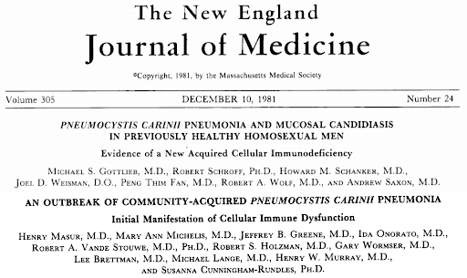

exclude: true

```{r setup, include=FALSE}
options(htmltools.dir.version = FALSE)
xaringan::summon_remark()
```

```{r xaringan-tile-view, echo=FALSE}
xaringanExtra::use_tile_view()
xaringanExtra::use_webcam()
xaringanExtra::use_tachyons()
xaringanExtra::use_animate_css()
xaringanExtra::use_share_again()
#xaringanExtra::use_scribble(pen_color = "#56106E")
```


---
class: top left hide-count
background-image: url(img/Pneumocystis_jirovecii_AO_AL_wikipedia_crop.png)
background-size: cover

.move-top20[
.title-text[<span style="font-size:0.8em">Measures of Disease in Clinical Epidemiology</span>]  
]  
  
.callout-url-leftcorner[
.title-nametext[
Brendan J. Kelly, MD, MS  
Infectious Diseases, Epidemiology & Microbiology  
University of Pennsylvania  
updated: `r format(Sys.Date(), '%d %B %Y')`  
]
]

.footnote-right[
<span style='color:white'>image: Federica Viazzi "Microscopy image of <i>P. jirovecii</i>" [(Wikipedia)](https://en.wikipedia.org/wiki/Pneumocystis_jirovecii#/media/File:Pneumocystis_jirovecii_AO_AL.jpg)</span>
]


---

## Disclosures  

.pad-left[
- No relevant disclosures.  

- No conflicts of interest.  

]


---

## Learning Objectives

.pad-left[
- Measures of disease occurrence: use population data to describe health and disease.

- Key concepts -- explain the meaning of:

    - prevalence
    - incidence (<ins>warning</ins>: multiple types)
    - relative risk (RR)
    - odds ratio (OR)

- Implementation: prevalence, incidence, RR, and OR from study data (2x2 tables!).

- Back to the beginning:  

    - how do we measure? 
    - data types and data distributions  

]


---

## Why Do I Care? ... 

.pad-left[
- Why use these tools (prevalence, incidence, RR, OR)?

     - inform differential diagnoses & counsel patients (<ins>your job</ins>)  
     
     - design public health interventions & direct new diagnostics/therapies (society!)   
     
     - understand distributions and determinants of diseases (science!)  

]


---

## ... What Do I Need to Know for the Test? 

.pad-left[
.grey-text[
- Why use these tools (prevalence, incidence, RR, OR)?

     - inform differential diagnoses & counsel patients (<ins>your job</ins>)  
     
     - design public health interventions & direct new diagnostics/therapies (society!)   
     
     - understand distributions and determinants of diseases (science!)  
     
]
- How to use these tools:

     - precise definitions 
     (e.g., RR vs OR, cumulative incidence vs incidence density)  
     
     - a bit of arithmetic  

]


---
class: full-screen hide-count

<div class="grid-3-2">
<div class="extension-tile gridset-a animated flipInY"><div>Case from 1981</div></div>
</div>


---
layout: false
class: full-screen hide-count

<div class="grid-3-2">
<div class="extension-tile gridset-a"><div>Case from 1981</div></div>
<div class="extension-tile gridset-b animated flipInX"><div>Prevalence</div></div>
</div>


---
layout: false
class: full-screen hide-count

<div class="grid-3-2">
<div class="extension-tile gridset-a"><div>Case from 1981</div></div>
<div class="extension-tile gridset-b"><div>Prevalence</div></div>
<div class="extension-tile gridset-c animated bounceInDown"><div>Incidence</div></div>
</div>


---
layout: false
class: full-screen hide-count

<div class="grid-3-2">
<div class="extension-tile gridset-a"><div>Case from 1981</div></div>
<div class="extension-tile gridset-b"><div>Prevalence</div></div>
<div class="extension-tile gridset-c"><div>Incidence</div></div>
<div class="extension-tile gridset-d animated fadeInRight"><div>Inference from<br>Exposures &<br>Outcomes</div></div>
</div>


---
layout: false
class: full-screen hide-count

<div class="grid-3-2">
<div class="extension-tile gridset-a"><div>Case from 1981</div></div>
<div class="extension-tile gridset-b"><div>Prevalence</div></div>
<div class="extension-tile gridset-c"><div>Incidence</div></div>
<div class="extension-tile gridset-d"><div>Inference from<br>Exposures &<br>Outcomes</div></div>
<div class="extension-tile gridset-e animated bounceInUp"><div>Relative Risk<br>&<br>Odds Ratios</div></div>
</div>


---
class: full-screen hide-count

<div class="grid-3-2">
<div class="extension-tile gridset-a"><div>Case from 1981</div></div>
<div class="extension-tile gridset-b"><div>Prevalence</div></div>
<div class="extension-tile gridset-c"><div>Incidence</div></div>
<div class="extension-tile gridset-d"><div>Inference from<br>Exposures &<br>Outcomes</div></div>
<div class="extension-tile gridset-e"><div>Relative Risk<br>&<br>Odds Ratios</div></div>
<div class="extension-tile gridset-f animated slideInLeft"><div>Data Types<br>&<br>Distributions</div></div>
</div>


---
class: full-screen hide-count

<div class="grid-3-2">
<div class="extension-tile gridset-a animated flipInY"><div>Case from 1981</div></div>
<div class="extension-tile gridset-grey"><div>Prevalence</div></div>
<div class="extension-tile gridset-grey"><div>Incidence</div></div>
<div class="extension-tile gridset-grey"><div>Inference from<br>Exposures &<br>Outcomes</div></div>
<div class="extension-tile gridset-grey"><div>Relative Risk<br>&<br>Odds Ratios</div></div>
<div class="extension-tile gridset-grey"><div>Data Types<br>&<br>Distributions</div></div>
</div>


---

## Case from 1981...   

.pad-left[
- 36-year-old man presents with a 4-month history of fever, dyspnea, and cough.

]


---
background-image: url(figs/hiv_timeline_mmwr_1981.png)
background-size: contain


???

Image credit: [MMWR](https://www.hiv.gov/hiv-basics/overview/history/hiv-and-aids-timeline)


---
exclude: true
background-image: url(figs/cover_mmwr_1981.jpg)
background-size: 750px
background-position: 50% 50%

## MMWR June 5, 1981


---
## MMWR June 5, 1981 

.bg-washed-blue.b--dark-blue.ba.bw2.br3.shadow-5.ph4.mt5.f4[
All the above observations suggest the possibility of a <mark>cellular-immune dysfunction related to a common exposure that predisposes individuals to opportunistic infections such as pneumocystosis and candidiasis</mark>. Although the role of CMV infection in the pathogenesis of pneumocystosis remains unknown, the possibility of _P. carinii_ infection must be carefully considered in a differential diagnosis for previously healthy homosexual males with dyspnea and pneumonia.
.tr[
— Gottlieb MS et al <ins>MMWR</ins> 1981
]]


---

## Stigmatization and Discrimination  

.pad-left[

- socially vulnerable groups often at higher infection risk  

    - HIV, COVID-19  

    - how we name infectious diseases has exacerbated stigma  
    
- demagogues call upon prejudice to gain political power  
  
    - homophobia in the 1980s  
    
    - anti-Asian racism in the 2020s  


]


---

## Causal Variables & Proxy Variables  

.pad-left[

- Race is a terrible proxy for biology

- Race exerts large effects on health:

    - structural racism

    - direct racism

- Some ways social vulnerability and racism impact health:

    - high-risk work

    - access to care  

    - social networks  

]


---

## Case from 1981... _Pneumocystis_ pneumonia? 

.pad-left[
- 36-year-old man presents with a 4-month history of fever, dyspnea, and cough.

- What do you want to know and why?  

    - history
    - vital signs
    - physical exam
    - laboratory test values
    - radiology  

- What is his diagnosis? Does he have _Pneumocystis_ pneumonia (PCP)?

]


---

## Case from 1981... _Pneumocystis_ pneumonia? 

.pad-left[
- Differential diagnosis must be grounded in understanding:

    - distributions of disease: we'll learn about **prevalence** & **incidence**  
    
    - determinants of disease: we'll learn **2x2 tables** to relate exposures and outcomes  
  
- In 1981, _Pneumocystis_ was known to be a low <ins>prevalence</ins> disease.

- New data would show an increasing <ins>incidence</ins>.  

<br/>

.center[<mark>(In ID, the differential is always evolving).</mark>]  

]


---

## Case from 1981... _Pneumocystis_ pneumonia? 

.pad-left[
- Does our patient have _Pneumocystis_ pneumonia (PCP)?

- How is the distribution of _Pneumocystis_ pneumonia changing?

- What are the determinants of _Pneumocystis_ pneumonia?
  
<br/>
  
.center[<mark>Note: questions depend on <strong>dichotomous</strong> definition of disease (yes/no <em>Pneumocystis</em>)</mark>]
  
]


---
class: full-screen hide-count

<div class="grid-3-2">
<div class="extension-tile gridset-grey"><div>Case from 1981</div></div>
<div class="extension-tile gridset-b animated flipInX"><div>Measuring<br>Disease<br>Occurrence</div></div>
<div class="extension-tile gridset-grey"><div>Incidence</div></div>
<div class="extension-tile gridset-grey"><div>Inference from<br>Exposures &<br>Outcomes</div></div>
<div class="extension-tile gridset-grey"><div>Relative Risk<br>&<br>Odds Ratios</div></div>
<div class="extension-tile gridset-grey"><div>Data Types<br>&<br>Distributions</div></div>
</div>


---
class: full-screen hide-count

<div class="grid-3-2">
<div class="extension-tile gridset-grey"><div>Case from 1981</div></div>
<div class="extension-tile gridset-b animated flipInX"><div>Prevalence</div></div>
<div class="extension-tile gridset-grey"><div>Incidence</div></div>
<div class="extension-tile gridset-grey"><div>Inference from<br>Exposures &<br>Outcomes</div></div>
<div class="extension-tile gridset-grey"><div>Relative Risk<br>&<br>Odds Ratios</div></div>
<div class="extension-tile gridset-grey"><div>Data Types<br>&<br>Distributions</div></div>
</div>


---

## Prevalence 

.pad-left[
- How common is _Pneumocystis_ pneumonia (PCP)?

- Prevalence: 

    - number with the disease / number in specified population  
    
    - **point prevalence**: at a specific point in time  
    
    - **period prevalence**: during a given period (e.g., 12-month prevalence)  
    
    - a proportion (unitless, ranges from 0-1)  
    
    - numerator includes all people who have the disease, both new and ongoing cases  
    
    - represents a <ins>cross-sectional</ins> “snapshot” of the population

]


---

## Prevalence of _Pneumocystis_ pneumonia 

.pad-left[
- In 1967, CDC became the sole supplier of pentamidine in the United States and began collecting data on cases of PCP:

    - period prevalence published in 1974<sup>*</sup>: 579 cases (194 confirmed) over 3 years
    - what’s the denominator?
    - what’s the prevalence?

- __Point prevalence__ of _Pneumocystis_ would be vanishingly small given limited duration of disease.

- From 1967-1974, even the __period prevalence__ was very small.

.footnote[[*] Walzer PD et al _Annals Int Med_ 1974]

]


---

## Point Prevalence versus Period Prevalence 

.pad-left[
- To understand the difference between point and period prevalence, let's imagine a cohort of people living with HIV/AIDS at risk for _Pneumocystis_:  

    - 50 high-risk subjects enrolled at the start of a two-year observation period  
    
    - cases of PCP each receive 3 weeks of antibiotic treatment (red on plot)  
    
    - incomplete follow-up (grey on plot)
    
    - some subjects started on _Pneumocystis_ prophylaxis (blue on plot)  

]


---

## Cohort at Risk for _Pneumocystis_ 

```{r pcp_study, echo=FALSE, warning=FALSE, message=FALSE, fig.height=7, fig.width=12, fig.align='center', fig.retina=2}

library(tidyverse)
set.seed(16)

tibble(subject_id = factor(seq(50)),
       enrollment = rep(0,50),
       exit = sample(x = c(rep(2,35),runif(n = 15, min = 1.7, max = 2)), size = 50, replace = FALSE),
       pcp_start = c(rep(NA,5),1.2,rep(NA,5),0.4,rep(NA,4),1.1,rep(NA,6),0.8,rep(NA,4),1.4,NA,0.3,rep(NA,3),1.0,rep(NA,6),0.1,rep(NA,4),0.9,rep(NA,3)),
       pcp_stop = pcp_start + 0.0577,
       ppx_start = c(rep(NA,4),1.5,rep(NA,5),1.6,rep(NA,6),1.4,rep(NA,3),1.7,rep(NA,3),1.4,rep(NA,1),1.3,rep(NA,2),1.55,rep(NA,9),1.2,rep(NA,5),1.5,rep(NA,3))) %>%
  group_by(subject_id) %>%
  nest() %>%
  mutate(exit_adjust = map_dbl(data, ~ ifelse(is.na(.x[["pcp_start"]]) & is.na(.x[["ppx_start"]]), sample(x = seq(1.5,2,0.1), size = 1), .x[["exit"]]))) %>%
  unnest(cols = c(data)) %>%
  ungroup() %>%
  mutate(ppx_stop = exit_adjust) %>%
  group_by(subject_id) %>%
  mutate(follow_start1 = enrollment,
         follow_stop1 = min(pcp_start, ppx_start, exit_adjust, na.rm = TRUE),
         follow_start2 = pcp_stop,
         follow_stop2 = min(ppx_start, exit_adjust, na.rm = TRUE)) %>%
  ungroup() %>%
  ggplot(data = .) +
  geom_segment(aes(x = enrollment, xend = exit_adjust, y = subject_id, yend = subject_id), colour = "grey", size = 1) +
  geom_segment(aes(x = pcp_start, xend = pcp_stop, y = subject_id, yend = subject_id), colour = "red", size = 1) +
  geom_point(aes(x = pcp_start, y = subject_id), colour = "red", size = 2) +
  geom_segment(aes(x = ppx_start, xend = ppx_stop, y = subject_id, yend = subject_id), colour = "blue", size = 1, size = 2) +
  labs(x = "Duration of Study Enrollment (years)", y = "Subject ID") +
  theme_classic() +
  theme(text = element_text(size = 22), axis.text.y = element_text(size = 10)) -> p

```

```{r print_pcp_study, echo=FALSE, warning=FALSE, message=FALSE, fig.height=7, fig.width=12, fig.align='center', fig.retina=2, dependson= "pcp_study"}

p


```


---

## Cohort at Risk for _Pneumocystis_ 

```{r print_pcp_study_label_case, echo=FALSE, warning=FALSE, message=FALSE, fig.height=7, fig.width=12, fig.align='center', fig.retina=2, dependson= "pcp_study"}

p +
  annotate(geom = "text", x = 0.1, y = 42, label = "Case &\nTreatment")


```


---

## Cohort at Risk for _Pneumocystis_ 

```{r print_pcp_study_label_followup, echo=FALSE, warning=FALSE, message=FALSE, fig.height=7, fig.width=12, fig.align='center', fig.retina=2, dependson= "pcp_study"}

p +
  annotate(geom = "text", x = 1.9, y = 3, label = "End of Follow-up")


```


---

## Cohort at Risk for _Pneumocystis_ 

```{r print_pcp_study_label_prophylaxis, echo=FALSE, warning=FALSE, message=FALSE, fig.height=7, fig.width=12, fig.align='center', fig.retina=2, dependson= "pcp_study"}

p +
  annotate(geom = "text", x = 1.9, y = 22, label = "Prophylactic\nAntibiotic")


```


---

## Cohort at Risk: Point Prevalence 

```{r pcp_point_prev, echo=FALSE, warning=FALSE, message=FALSE, fig.height=7, fig.width=12, fig.align='center', fig.retina=2, dependson= "pcp_study"}

p + annotate("rect", xmin=0.9, xmax=0.91, ymin=0, ymax=Inf, alpha=0.6, fill="purple")
  #+ geom_vline(aes(xintercept = 0.9), colour = "purple", size = 3, alpha = 0.4)


```


---

## Cohort at Risk: Period Prevalence 

```{r pcp_period_prev, echo=FALSE, warning=FALSE, message=FALSE, fig.height=7, fig.width=12, fig.align='center', fig.retina=2, dependson= "pcp_study"}

p + annotate("rect", xmin=0.9, xmax=1.2, ymin=0, ymax=Inf, alpha=0.6, fill="purple")


```


---

## Prevalence 

.pad-left[
- Prevalence is **NOT** the same as risk.

- Prevalence numerator includes all people who have the disease, both new and ongoing cases, so represents a cross-sectional “snapshot” of the population. 

- Prevalence does **NOT** estimate the risk of developing the disease because <mark>prevalence does **NOT** fully account for time </mark> (are the measured cases old cases or new cases?).

]


---

## Reflection Question 

.pad-left[
How can an infection have high prevalence if it occurs infrequently?

- (A) the infection is rapidly fatal

- (B) the infection rapidly resolves

- (C) a few children get the infection every year, but the infection persists for the rest of their lives

- (D) the infection results in lifelong protective immunity

]


---
class: full-screen hide-count

<div class="grid-3-2">
<div class="extension-tile gridset-grey"><div>Case from 1981</div></div>
<div class="extension-tile gridset-grey"><div>Prevalence</div></div>
<div class="extension-tile gridset-c animated flipInY"><div>Measuring<br>Disease<br>Occurrence</div></div>
<div class="extension-tile gridset-grey"><div>Inference from<br>Exposures &<br>Outcomes</div></div>
<div class="extension-tile gridset-grey"><div>Relative Risk<br>&<br>Odds Ratios</div></div>
<div class="extension-tile gridset-grey"><div>Data Types<br>&<br>Distributions</div></div>
</div>


---
class: full-screen hide-count

<div class="grid-3-2">
<div class="extension-tile gridset-grey"><div>Case from 1981</div></div>
<div class="extension-tile gridset-grey"><div>Prevalence</div></div>
<div class="extension-tile gridset-c animated flipInY"><div>Incidence</div></div>
<div class="extension-tile gridset-grey"><div>Inference from<br>Exposures &<br>Outcomes</div></div>
<div class="extension-tile gridset-grey"><div>Relative Risk<br>&<br>Odds Ratios</div></div>
<div class="extension-tile gridset-grey"><div>Data Types<br>&<br>Distributions</div></div>
</div>


---

## Case from 1981... _Pneumocystis_ pneumonia? 

.pull-left[

]

.pull-right[

<br/>

- new _Pneumocystis_ cases (NYC<sup>1</sup>): 13 cases over 21 months  

- new _Pneumocystis_ cases (LA<sup>2</sup>): 5 cases over 7 months  

- concurrent opportunistic infections:  

    - CMV
    - _Candida_
    - Kaposi's sarcoma  

]

.footnote[[1,2] Masur H et al _NEJM_ 1981; Gottlieb MS et al _NEJM_ 1981]


---

## Incidence 

.pad-left[
- Among MSM, _Pneumocystis_ pneumonia (PCP) is occurring more frequently...

- Incidence: occurrence of new cases over a given period of time.

- **cumulative incidence**:  

$$cumulative\ incidence = \frac{{new\ cases}}{persons\ at\ risk\\at\ start\ time\ interval}$$  

- **incidence density**: (more precise)  

$$incidence\ density = \frac{new\ cases}{person\ time\\at\ risk}$$  
    
]


---

## Cumulative Incidence 

.pad-left[
- Cumulative incidence:

    - must specify population consisting of at-risk individuals  
    
    - must specify a time period of observation  
    
    - <ins>numerator</ins> = all new cases during a specified time period  
    
    - <ins>denominator</ins> = all individuals at risk in the specified population at the start of the specified time period (does NOT account for deaths due to other causes)  
    
    - ranges from 0 to 1 (a.k.a., “incidence proportion”)  
    
    - like prevalence, is a proportion and therefore has no units (but only makes sense if you specify the time period of observation, e.g., % per year)  
    
]


    

---

## Incidence Density 

.pad-left[
- Incidence density:

    - in a specified population consisting of at risk individuals over a specified period of observation, more precisely quantifies the person-time at risk  
    
    - <ins>numerator</ins> = all new cases during a specified time period  
    
    - <ins>denominator</ins> = the sum, over all individuals in the population, of time at risk until the event of interest, death, loss to follow-up, the end of the study, or when they are no longer at risk for whatever reason  
    
    - not a proportion; range depends on the units of person-time (0 to infinity)  
    
    - <mark>accounts for death from other causes!</mark>

]


---

## Incidence: Which Denominator? 

.pad-left[
- To understand the difference between cumulative incidence and incidence density, let's return to our imagined study of people living with HIV/AIDS at risk for _Pneumocystis_:  

    - 50 high-risk subjects enrolled at the start of a two-year observation period  
    
    - cases of PCP each receive 3 weeks of antibiotic treatment (red on plot)  
    
    - incomplete follow-up (grey on plot)
    
    - some subjects started on _Pneumocystis_ prophylaxis (blue on plot)  

]


---

## Cohort at Risk for _Pneumocystis_ 

```{r reprint_pcp_study, echo=FALSE, warning=FALSE, message=FALSE, fig.height=7, fig.width=12, fig.align='center', fig.retina=2, dependson= "pcp_study"}

p


```


---

## Cohort at Risk for _Pneumocystis_ 

```{r print_pcp_study_label_case2, echo=FALSE, warning=FALSE, message=FALSE, fig.height=7, fig.width=12, fig.align='center', fig.retina=2, dependson= "pcp_study"}

p +
  annotate(geom = "text", x = 0.1, y = 42, label = "Case &\nTreatment")


```


---

## Cohort at Risk for _Pneumocystis_ 

```{r print_pcp_study_label_followup2, echo=FALSE, warning=FALSE, message=FALSE, fig.height=7, fig.width=12, fig.align='center', fig.retina=2, dependson= "pcp_study"}

p +
  annotate(geom = "text", x = 1.9, y = 3, label = "End of Follow-up")


```


---

## Cohort at Risk for _Pneumocystis_ 

```{r print_pcp_study_label_prophylaxis2, echo=FALSE, warning=FALSE, message=FALSE, fig.height=7, fig.width=12, fig.align='center', fig.retina=2, dependson= "pcp_study"}

p +
  annotate(geom = "text", x = 1.9, y = 22, label = "Prophylactic\nAntibiotic")


```


---

## Cohort at Risk: Cumulative Incidence (at risk at start) 

```{r pcp_incid_proportion, echo=FALSE, warning=FALSE, message=FALSE, fig.height=7, fig.width=12, fig.align='center', fig.retina=2, dependson= "pcp_study"}

p + geom_point(aes(x = 0, y = subject_id), colour = "green", size = 3, alpha = 0.4) +
  geom_segment(aes(x = enrollment, xend = 2, y = subject_id, yend = subject_id), colour = "green", size = 2, alpha = 0.4, linetype = 1)


```


---

## Cohort at Risk: Incidence Density (person-time at risk) 

```{r pcp_incid_density, echo=FALSE, warning=FALSE, message=FALSE, fig.height=7, fig.width=12, fig.align='center', fig.retina=2, dependson= "pcp_study"}

p + geom_point(aes(x = 0, y = subject_id), colour = "green", size = 3, alpha = 0.4) +
  geom_segment(aes(x = follow_start1, xend = follow_stop1, y = subject_id, yend = subject_id), colour = "green", size = 2, alpha = 0.4, linetype = 1) +
    geom_segment(aes(x = follow_start2, xend = follow_stop2, y = subject_id, yend = subject_id), colour = "green", size = 2, alpha = 0.4, linetype = 1)


```


---

## Incidence: Which Denominator? 

.pad-left[
- Cumulative incidence of _Pneumocystis_ versus incidence density:

    - if the end of the grey line is death / loss to follow-up, how does incidence density compare to annual cumulative incidence?

    - if you don’t count time on prophylaxis or treatment antibiotics as “time at risk”, how does the incidence density compare to the annual cumulative incidence?  


]


---

## Notes on Population at Risk 

.pad-left[
- In a population, individuals are at risk of disease if they: 

    - (1) do not have the disease at baseline  
    
    - (2) are capable of developing the disease (e.g., have the organ of interest; have not been successfully immunized against the disease; haven’t developed lifelong immunity)  
    

- The difference between cumulative incidence and incidence density is that the latter attempts a more precise quantification of population at risk -- it’s harder to evaluate, but more informative if you can.

]


---

## Notes on Person-Time 

.pad-left[
- To improve precision of risk estimate (<ins>incidence density</ins>), we measure:  

    - population at risk of outcome  
    
    - actual time at risk (during which outcome could occur)

- **Person-time**:  

    - denominator for incidence density  
    
    - the product of population at risk and time at risk (e.g., patient-months)

]


---

## Beware the Phrase “Incidence Rate”! 

.pad-left[
- “Incidence rate” is used to mean two different things:

    - number new cases / number persons at risk @ start (short) time interval (e.g., “annual incidence rate” to mean cumulative incidence over one year)  
    
    - number new cases / person-time at risk (i.e., incidence density, the precise rate)

]


---

## Reflection Question 

.pad-left[
Your patient with HIV is considering starting prophylactic antibiotics for PCP. You have PCP prevalence, cumulative incidence, and incidence density data available. Which data provide the most precise information on the patient’s risk of PCP off of prophylaxis?

- (A) prevalence

- (B) cumulative incidence

- (C) incidence density

]


---
background-image: url(figs/bathtub_labelled.svg)
background-size: 520px
background-position: 50% 70%

## Can You Tell Prevalence from Incidence?


---

## Can You Tell Prevalence from Incidence?

.pad-left[
- HIV in Rakai, Uganda 1994-2003*:

    - intensive “ABC” intervention (Abstinence, Be faithful, Condoms)
    
    - prevalence declined...  
    
    - incidence remained constant at 1.5% per year!
    
    - what happened?

.footnote[[*] Wawer M et al _CROI_ 2005; Roehr B _BMJ_ 2005]

]


---
class: full-screen hide-count

<div class="grid-3-2">
<div class="extension-tile gridset-grey"><div>Case from 1981</div></div>
<div class="extension-tile gridset-grey"><div>Prevalence</div></div>
<div class="extension-tile gridset-grey"><div>Incidence</div></div>
<div class="extension-tile gridset-d animated flipInX"><div>What<br>determines<br>risk?</div></div>
<div class="extension-tile gridset-grey"><div>Relative Risk<br>&<br>Odds Ratios</div></div>
<div class="extension-tile gridset-grey"><div>Data Types<br>&<br>Distributions</div></div>
</div>


---
class: full-screen hide-count

<div class="grid-3-2">
<div class="extension-tile gridset-grey"><div>Case from 1981</div></div>
<div class="extension-tile gridset-grey"><div>Prevalence</div></div>
<div class="extension-tile gridset-grey"><div>Incidence</div></div>
<div class="extension-tile gridset-d animated flipInX"><div>Inference from<br>Exposures &<br>Outcomes</div></div>
<div class="extension-tile gridset-grey"><div>Relative Risk<br>&<br>Odds Ratios</div></div>
<div class="extension-tile gridset-grey"><div>Data Types<br>&<br>Distributions</div></div>
</div>


---

## Basics of Study Types 

.pad-left[
- We want to understand the <mark>relationship between risk factors (exposures) and disease (outcomes)</mark>. For example, between CD4 count and PCP in HIV.

- To calculate incidence need to know how many are in a population:

    - randomized trials: pick the population, randomize, control the treatment, and measure the outcome  
    
    - cohort studies: pick the population, divide into preselected exposure (treatment or risk factor) groups, and measure the outcome  

- But do NOT know this in case control studies: pick the cases and control groups, then measure rates of exposure (do NOT know size of population at risk).  

]


---

```{r eval=TRUE, warning=FALSE, message=FALSE, echo=FALSE, fig.align='left', fig.width=15, fig.height=9, fig.retina=2}
library(DiagrammeR)

c_graph <-
  create_graph() %>%
  add_node(label = 'Study\nDesign', node_aes = node_aes(fontsize = 6, color = 'black', fillcolor = 'grey90', fontcolor = 'black')) %>%
  add_node(label = 'Cohort', node_aes = node_aes(fontsize = 6, color = 'black', fillcolor = 'grey90', fontcolor = 'black')) %>%
  add_node(label = 'Randomized\nControlled\nTrial', node_aes = node_aes(fontsize = 5.5, color = 'black', fillcolor = 'grey90', fontcolor = 'black')) %>%
  add_node(label = 'Case-\nControl', node_aes = node_aes(fontsize = 6, color = 'black', fillcolor = 'grey90', fontcolor = 'black')) %>%
  add_node(label = 'Denominator\nKnown', node_aes = node_aes(fontsize = 6, color = 'black', fillcolor = 'green', fontcolor = 'black')) %>%
  add_node(label = 'Denominator\nNOT Known', node_aes = node_aes(fontsize = 6, color = 'black', fillcolor = 'dodgerblue', fontcolor = 'black')) %>%
  add_node(label = 'Measure\nOutcome\nIncidence', node_aes = node_aes(fontsize = 6, color = 'black', fillcolor = 'grey90', fontcolor = 'black')) %>%
  add_node(label = 'Measure\nExposure\nOdds', node_aes = node_aes(fontsize = 6, color = 'black', fillcolor = 'grey90', fontcolor = 'black')) %>%
  add_node(label = 'Relative\nRisk', node_aes = node_aes(fontsize = 6, color = 'black', fillcolor = 'grey90', fontcolor = 'black')) %>%
  add_node(label = 'Odds\nRatio', node_aes = node_aes(fontsize = 6, color = 'black', fillcolor = 'grey90', fontcolor = 'black')) %>%
  add_node(label = 'AR\nRD\nNNT', node_aes = node_aes(fontsize = 6, color = 'black', fillcolor = 'grey90', fontcolor = 'black')) %>%
  add_edge(from = 'Study\nDesign',to = 'Cohort', edge_aes = edge_aes(color = 'black')) %>%
  add_edge(from = 'Study\nDesign',to = 'Randomized\nControlled\nTrial', edge_aes = edge_aes(color = 'black')) %>%
  add_edge(from = 'Study\nDesign',to = 'Case-\nControl', edge_aes = edge_aes(color = 'black')) %>%
  add_edge(from = 'Cohort', to = 'Denominator\nKnown', edge_aes = edge_aes(color = 'black')) %>%
  add_edge(from = 'Randomized\nControlled\nTrial', to = 'Denominator\nKnown', edge_aes = edge_aes(color = 'black')) %>%
  add_edge(from = 'Case-\nControl', to = 'Denominator\nNOT Known', edge_aes = edge_aes(color = 'black')) %>%
  add_edge(from = 'Denominator\nKnown', to = 'Measure\nOutcome\nIncidence', edge_aes = edge_aes(color = 'black')) %>%
  add_edge(from = 'Denominator\nNOT Known', to = 'Measure\nExposure\nOdds', edge_aes = edge_aes(color = 'black')) %>%
  add_edge(from = 'Measure\nOutcome\nIncidence', to = 'Relative\nRisk', edge_aes = edge_aes(color = 'black')) %>%
  add_edge(from = 'Measure\nExposure\nOdds', to = 'Odds\nRatio', edge_aes = edge_aes(color = 'black')) %>%
  add_edge(from = 'Relative\nRisk', to = 'AR\nRD\nNNT', edge_aes = edge_aes(color = 'black')) %>%
  set_node_position(node = 1, x = -3, y = 0) %>%
  set_node_position(node = 2, x = -2, y = 0) %>%
  set_node_position(node = 3, x = -2, y = 1) %>%
  set_node_position(node = 4, x = -2, y = -1) %>%
  set_node_position(node = 5, x = -1, y = 0.5) %>%
  set_node_position(node = 6, x = -1, y = -0.5) %>%
  set_node_position(node = 7, x = 0, y = 0.5) %>%
  set_node_position(node = 8, x = 0, y = -0.5) %>%
  set_node_position(node = 9, x = 1, y = 0.5) %>%
  set_node_position(node = 10, x = 1, y = -0.5) %>%
  set_node_position(node = 11, x = 2, y = 0.5)

c_graph %>% render_graph()


```


---

## 2x2 Table 

.pull-left[
- Dichotomous exposures and outcomes.

- Examine relationships between exposures and outcomes.  
  
- <ins>Goal</ins>: inference about larger world.  

]

.pull-right[
```{r eval=TRUE, warning=FALSE, message=FALSE, echo=FALSE, fig.align='center', fig.width=5, fig.height=5, fig.retina=2}
library(tidyverse)

tibble(Exposure = factor(x = c("+","-"), levels = c("-","+")), Outcome = factor(x = c("+","-"), levels = c("+","-"))) %>%
  complete(Exposure,Outcome) %>%
  mutate(cells = c("C","D","A","B"),
         cells_order = factor(x = c(3,4,1,2))) %>%
  ggplot(data = .) +
  geom_tile(aes(x = Outcome, y = Exposure, fill = cells_order)) +
  geom_text(aes(x = Outcome, y = Exposure, label = cells), size = 16) +
  scale_x_discrete(position = 'top') +
  ggsci::scale_fill_nejm() +
  theme_minimal() +
  theme(axis.text.y = element_text(size = 28),
        axis.text.x.top = element_text(size = 28),
        axis.title = element_text(size = 28),
        panel.grid.major = element_blank(),
        legend.position = 'none') +
  coord_equal()

```
]


---

## 2x2 Table 

.pull-left[
- Dichotomous exposures and outcomes.

- Examine relationships between exposures and outcomes.  
  
- <ins>Goal</ins>: inference about larger world.  

]

.pull-right[
```{r eval=TRUE, warning=FALSE, message=FALSE, echo=FALSE, fig.align='center', fig.width=5, fig.height=5, fig.retina=2}
library(tidyverse)

tibble(`AIDS` = factor(x = c("+","-"), levels = c("-","+")), Pneumocystis = factor(x = c("+","-"), levels = c("+","-"))) %>%
  complete(`AIDS`,Pneumocystis) %>%
  mutate(cells = c("5","15","10","10"),
         cells_order = factor(x = c(3,4,1,2))) %>%
  ggplot(data = .) +
  geom_tile(aes(x = Pneumocystis, y = `AIDS`, fill = cells_order)) +
  geom_text(aes(x = Pneumocystis, y = `AIDS`, label = cells), size = 16) +
  scale_x_discrete(position = 'top') +
  ggsci::scale_fill_nejm() +
  theme_minimal() +
  theme(axis.text.y = element_text(size = 28),
        axis.text.x.top = element_text(size = 28),
        axis.title = element_text(size = 28),
        panel.grid.major = element_blank(),
        legend.position = 'none') +
  coord_equal()

```
]


---

## 2x2 Table 

.pull-left[
- Dichotomous exposures and outcomes.

- Examine relationships between exposures and outcomes.  
  
- <ins>Goal</ins>: inference about larger world.

- <mark>Is study RCT/cohort or case-control?</mark>  
  
- Can always calculate a <ins>relative risk (RR)</ins> from 2x2 table but only appropriate for <ins>RCT/cohort</ins>  
  
- Can always calculate an <ins>odds ratio (OR)</ins> from 2x2 table but only appropriate for <ins>case-control study</ins><br/>(can do better with RR if RCT/cohort)  

]


.pull-right[
```{r eval=TRUE, warning=FALSE, message=FALSE, echo=FALSE, fig.align='center', fig.width=5, fig.height=5, fig.retina=2}
library(tidyverse)

tibble(`AIDS` = factor(x = c("+","-"), levels = c("-","+")), Pneumocystis = factor(x = c("+","-"), levels = c("+","-"))) %>%
  complete(`AIDS`,Pneumocystis) %>%
  mutate(cells = c("5","15","10","10"),
         cells_order = factor(x = c(3,4,1,2))) %>%
  ggplot(data = .) +
  geom_tile(aes(x = Pneumocystis, y = `AIDS`, fill = cells_order)) +
  geom_text(aes(x = Pneumocystis, y = `AIDS`, label = cells), size = 16) +
  scale_x_discrete(position = 'top') +
  ggsci::scale_fill_nejm() +
  theme_minimal() +
  theme(axis.text.y = element_text(size = 28),
        axis.text.x.top = element_text(size = 28),
        axis.title = element_text(size = 28),
        panel.grid.major = element_blank(),
        legend.position = 'none') +
  coord_equal()

```
]


---
class: full-screen hide-count

<div class="grid-3-2">
<div class="extension-tile gridset-grey"><div>Case from 1981</div></div>
<div class="extension-tile gridset-grey"><div>Prevalence</div></div>
<div class="extension-tile gridset-grey"><div>Incidence</div></div>
<div class="extension-tile gridset-grey"><div>Inference from<br>Exposures &<br>Outcomes</div></div>
<div class="extension-tile gridset-e animated flipInY"><div>2x2 tables<br>are HARD!</div></div>
<div class="extension-tile gridset-grey"><div>Data Types<br>&<br>Distributions</div></div>
</div>


---
class: full-screen hide-count

<div class="grid-3-2">
<div class="extension-tile gridset-grey"><div>Case from 1981</div></div>
<div class="extension-tile gridset-grey"><div>Prevalence</div></div>
<div class="extension-tile gridset-grey"><div>Incidence</div></div>
<div class="extension-tile gridset-grey"><div>Inference from<br>Exposures &<br>Outcomes</div></div>
<div class="extension-tile gridset-e animated flipInY"><div>Relative Risk<br>&<br>Odds Ratios</div></div>
<div class="extension-tile gridset-grey"><div>Data Types<br>&<br>Distributions</div></div>
</div>


---

## 2x2 Table: Calculate Relative Risk for Cohort/Trial 

.pull-left[
- Relative Risk (RR): risk (incidence) exposed / risk (incidence) unexposed:    

$$RR = \frac{\frac{A}{(A + B)}}{\frac{C}{(C + D)}}$$  

- Risk difference (RD): risk (incidence) exposed - risk (incidence) unexposed:  

$$RD = \frac{A}{(A + B)} - \frac{C}{(C + D)}$$  

]

.pull-right[
```{r eval=TRUE, warning=FALSE, message=FALSE, echo=FALSE, fig.align='center', fig.width=5, fig.height=5, fig.retina=2}
library(tidyverse)

tibble(Exposure = factor(x = c("+","-"), levels = c("-","+")), Outcome = factor(x = c("+","-"), levels = c("+","-"))) %>%
  complete(Exposure,Outcome) %>%
  mutate(cells = c("C","D","A","B"),
         cells_order = factor(x = c(3,4,1,2))) %>%
  ggplot(data = .) +
  geom_tile(aes(x = Outcome, y = Exposure, fill = cells_order)) +
  geom_text(aes(x = Outcome, y = Exposure, label = cells), size = 16) +
  scale_x_discrete(position = 'top') +
  ggsci::scale_fill_nejm() +
  theme_minimal() +
  theme(axis.text.y = element_text(size = 28),
        axis.text.x.top = element_text(size = 28),
        axis.title = element_text(size = 28),
        panel.grid.major = element_blank(),
        legend.position = 'none') +
  coord_equal()

```
]


---

## PCP ~ AIDS: Relative Risk (RR) 

.pull-left[

- Imagine a cohort study examining incidence (risk) for _Pneumocystis_ among patients with or without an Acquired Immunodeficiency Syndrome (AIDS):

- Relative Risk (RR):

$$RR = \frac{\frac{10}{(10 + 10)}}{\frac{5}{(5 + 15)}} = \frac{0.5}{0.25} = 2$$  

- Risk difference (RD):

$$RD = \frac{10}{(10 + 10)} - \frac{5}{(5 + 15)} = 0.25$$  

]

.pull-right[
```{r eval=TRUE, warning=FALSE, message=FALSE, echo=FALSE, fig.align='center', fig.width=5, fig.height=5, fig.retina=2}
library(tidyverse)

tibble(`AIDS` = factor(x = c("+","-"), levels = c("-","+")), Pneumocystis = factor(x = c("+","-"), levels = c("+","-"))) %>%
  complete(`AIDS`,Pneumocystis) %>%
  mutate(cells = c("5","15","10","10"),
         cells_order = factor(x = c(3,4,1,2))) %>%
  ggplot(data = .) +
  geom_tile(aes(x = Pneumocystis, y = `AIDS`, fill = cells_order)) +
  geom_text(aes(x = Pneumocystis, y = `AIDS`, label = cells), size = 16) +
  scale_x_discrete(position = 'top') +
  ggsci::scale_fill_nejm() +
  theme_minimal() +
  theme(axis.text.y = element_text(size = 28),
        axis.text.x.top = element_text(size = 28),
        axis.title = element_text(size = 28),
        panel.grid.major = element_blank(),
        legend.position = 'none') +
  coord_equal()

```
]


---

## 2x2 Table: Calculate NNT for Cohort/Trial 

.pull-left[

- Risk difference (RD): risk (incidence) exposed - risk (incidence) unexposed:  

$$RD = \frac{A}{(A + B)} - \frac{C}{(C + D)}$$  

- Number needed to treat (NNT): given RD between exposures, how many exposure switches needed to change one outcome:  

$$NNT = \frac{1}{RD} = \frac{1}{\frac{A}{(A + B)} - \frac{C}{(C + D)}}$$  

]

.pull-right[
```{r eval=TRUE, warning=FALSE, message=FALSE, echo=FALSE, fig.align='center', fig.width=5, fig.height=5, fig.retina=2}
library(tidyverse)

tibble(Exposure = factor(x = c("+","-"), levels = c("-","+")), Outcome = factor(x = c("+","-"), levels = c("+","-"))) %>%
  complete(Exposure,Outcome) %>%
  mutate(cells = c("C","D","A","B"),
         cells_order = factor(x = c(3,4,1,2))) %>%
  ggplot(data = .) +
  geom_tile(aes(x = Outcome, y = Exposure, fill = cells_order)) +
  geom_text(aes(x = Outcome, y = Exposure, label = cells), size = 16) +
  scale_x_discrete(position = 'top') +
  ggsci::scale_fill_nejm() +
  theme_minimal() +
  theme(axis.text.y = element_text(size = 28),
        axis.text.x.top = element_text(size = 28),
        axis.title = element_text(size = 28),
        panel.grid.major = element_blank(),
        legend.position = 'none') +
  coord_equal()

```
]

---

## PCP ~ AIDS: Number Needed to Treat 

.pull-left[

- Cohort study examining incidence (risk) for _Pneumocystis_ among patients with or without AIDS:

- Risk difference (RD):

$$RD = \frac{10}{(10 + 10)} - \frac{5}{(5 + 15)} = 0.25$$  

- Number needed to treat (NNT): given RD between exposures, how many exposure switches needed to change one outcome:  

$$NNT = \frac{1}{RD} = \frac{1}{\frac{10}{(10 + 10)} - \frac{5}{(5 + 15)}} = \frac{1}{0.25} = 4$$  

]

.pull-right[
```{r eval=TRUE, warning=FALSE, message=FALSE, echo=FALSE, fig.align='center', fig.width=5, fig.height=5, fig.retina=2}
library(tidyverse)

tibble(`AIDS` = factor(x = c("+","-"), levels = c("-","+")), Pneumocystis = factor(x = c("+","-"), levels = c("+","-"))) %>%
  complete(`AIDS`,Pneumocystis) %>%
  mutate(cells = c("5","15","10","10"),
         cells_order = factor(x = c(3,4,1,2))) %>%
  ggplot(data = .) +
  geom_tile(aes(x = Pneumocystis, y = `AIDS`, fill = cells_order)) +
  geom_text(aes(x = Pneumocystis, y = `AIDS`, label = cells), size = 16) +
  scale_x_discrete(position = 'top') +
  ggsci::scale_fill_nejm() +
  theme_minimal() +
  theme(axis.text.y = element_text(size = 28),
        axis.text.x.top = element_text(size = 28),
        axis.title = element_text(size = 28),
        panel.grid.major = element_blank(),
        legend.position = 'none') +
  coord_equal()

```
]


---

## AR vs RD vs NNT 

.pad-left[
- **absolute risk (AR)**: risk of developing disease over a period of time (<mark>incidence!</mark>)

    - if 1 in 10 chance of developing skin cancer in your lifetime, AR = 10%

- **risk difference (RD)**: difference in risk between treatment/exposure and control

    - 3 in 10 cured with treatment vs 2 in 10 with control, RD = 3/10 – 2/10 = 10%

- **number needed to treat (NNT)**: number treated for one person to benefit 

    - NNT = 1/RD
    - from RD numbers above, NNT = 1/RD = 1/0.1 = 10 (treat 10 people to cure 1 more)

]


---

## 2x2 Table: Calculate Odds Ratio for Case-Control Study 

.pull-left[

- Denominators are deceptive in case-control study because determined by investigator.

- Impossible to measure true risk/incidence. Instead, measure exposure odds in cases & controls.

- Odds Ratio (OR): odds exposure in cases / odds exposure in controls:    

$$OR = \frac{\frac{A}{C}}{\frac{B}{D}} = \frac{A*D}{B*C}$$  
]


.pull-right[
```{r eval=TRUE, warning=FALSE, message=FALSE, echo=FALSE, fig.align='center', fig.width=5, fig.height=5, fig.retina=2}
library(tidyverse)

tibble(Exposure = factor(x = c("+","-"), levels = c("-","+")), Outcome = factor(x = c("+","-"), levels = c("+","-"))) %>%
  complete(Exposure,Outcome) %>%
  mutate(cells = c("C","D","A","B"),
         cells_order = factor(x = c(3,4,1,2))) %>%
  ggplot(data = .) +
  geom_tile(aes(x = Outcome, y = Exposure, fill = cells_order)) +
  geom_text(aes(x = Outcome, y = Exposure, label = cells), size = 16) +
  scale_x_discrete(position = 'top') +
  ggsci::scale_fill_nejm() +
  theme_minimal() +
  theme(axis.text.y = element_text(size = 28),
        axis.text.x.top = element_text(size = 28),
        axis.title = element_text(size = 28),
        panel.grid.major = element_blank(),
        legend.position = 'none') +
  coord_equal()

```
]


---

## PCP Cases vs Controls: Odds Ratio (OR) 

.pull-left[

- Imagine a different study: 100 _Pneumocystis_ cases and 100 controls; measure whether 'AIDS' (exposure) differs between groups chosen by investigator.

- Odds Ratio (OR): odds exposure in cases / odds exposure in controls:    

$$OR = \frac{\frac{90}{10}}{\frac{50}{50}} = \frac{90*50}{50*10} = 9$$  
]


.pull-right[
```{r eval=TRUE, warning=FALSE, message=FALSE, echo=FALSE, fig.align='center', fig.width=5, fig.height=5, fig.retina=2}
library(tidyverse)

tibble(`AIDS` = factor(x = c("+","-"), levels = c("-","+")), Pneumocystis = factor(x = c("+","-"), levels = c("+","-"))) %>%
  complete(`AIDS`,Pneumocystis) %>%
  mutate(cells = c("10","50","90","50"),
         cells_order = factor(x = c(3,4,1,2))) %>%
  ggplot(data = .) +
  geom_tile(aes(x = Pneumocystis, y = `AIDS`, fill = cells_order)) +
  geom_text(aes(x = Pneumocystis, y = `AIDS`, label = cells), size = 16) +
  scale_x_discrete(position = 'top') +
  ggsci::scale_fill_nejm() +
  theme_minimal() +
  theme(axis.text.y = element_text(size = 28),
        axis.text.x.top = element_text(size = 28),
        axis.title = element_text(size = 28),
        panel.grid.major = element_blank(),
        legend.position = 'none') +
  coord_equal()

```
]

---

## Utility of Odds Ratio (OR) & Case-Control Study Design 

.pull-left[

- Because ratio of cases and controls determined by investigator, not valid to calculate incidence of outcome (AR or RR, RD, NNT), but if outcome incidence is low, then A + B ~ B & C + D ~ D:

$$RR = \frac{\frac{A}{(A + B)}}{\frac{C}{(C + D)}} \sim \frac{\frac{A}{B}}{\frac{C}{D}} = \frac{A*D}{B*C} = \frac{\frac{A}{C}}{\frac{B}{D}} = OR$$  

- OR approximates RR if outcome occurs infrequently (<15%). <mark>Though OR is fundamentally different from RR, we use it as an approximation of RR</mark>.  

- If outcome is more common, OR will differ increasingly from RR.

]


.pull-right[
```{r eval=TRUE, warning=FALSE, message=FALSE, echo=FALSE, fig.align='center', fig.width=5, fig.height=5, fig.retina=2}
library(tidyverse)

tibble(Exposure = factor(x = c("+","-"), levels = c("-","+")), Outcome = factor(x = c("+","-"), levels = c("+","-"))) %>%
  complete(Exposure,Outcome) %>%
  mutate(cells = c("C","D","A","B"),
         cells_order = factor(x = c(3,4,1,2))) %>%
  ggplot(data = .) +
  geom_tile(aes(x = Outcome, y = Exposure, fill = cells_order)) +
  geom_text(aes(x = Outcome, y = Exposure, label = cells), size = 16) +
  scale_x_discrete(position = 'top') +
  ggsci::scale_fill_nejm() +
  theme_minimal() +
  theme(axis.text.y = element_text(size = 28),
        axis.text.x.top = element_text(size = 28),
        axis.title = element_text(size = 28),
        panel.grid.major = element_blank(),
        legend.position = 'none') +
  coord_equal()

```
]


---
class: full-screen hide-count

<div class="grid-3-2">
<div class="extension-tile gridset-grey"><div>Case from 1981</div></div>
<div class="extension-tile gridset-grey"><div>Prevalence</div></div>
<div class="extension-tile gridset-grey"><div>Incidence</div></div>
<div class="extension-tile gridset-grey"><div>Inference from<br>Exposures &<br>Outcomes</div></div>
<div class="extension-tile gridset-grey"><div>Relative Risk<br>&<br>Odds Ratios</div></div>
<div class="extension-tile gridset-f animated flipInX"><div>2x2 tables<br>focus on<br>dichotomous<br>data...</div></div>
</div>


---
class: full-screen hide-count

<div class="grid-3-2">
<div class="extension-tile gridset-grey"><div>Case from 1981</div></div>
<div class="extension-tile gridset-grey"><div>Prevalence</div></div>
<div class="extension-tile gridset-grey"><div>Incidence</div></div>
<div class="extension-tile gridset-grey"><div>Inference from<br>Exposures &<br>Outcomes</div></div>
<div class="extension-tile gridset-grey"><div>Relative Risk<br>&<br>Odds Ratios</div></div>
<div class="extension-tile gridset-f animated flipInX"><div>Not all data are<br>dichotomous!</div></div>
</div>


---
class: full-screen hide-count

<div class="grid-3-2">
<div class="extension-tile gridset-grey"><div>Case from 1981</div></div>
<div class="extension-tile gridset-grey"><div>Prevalence</div></div>
<div class="extension-tile gridset-grey"><div>Incidence</div></div>
<div class="extension-tile gridset-grey"><div>Inference from<br>Exposures &<br>Outcomes</div></div>
<div class="extension-tile gridset-grey"><div>Relative Risk<br>&<br>Odds Ratios</div></div>
<div class="extension-tile gridset-f animated flipInX"><div>Data Types<br>&<br>Distributions</div></div>
</div>


---

## Data Types 

.pad-left[
- Vital signs and physical exam:

    - temperature (degrees) - continuous
    - heart / respiratory rate (beats or breaths / min) - continuous
    - oxygen saturation (%) - continuous

- Laboratory values:

    - white blood cell count (cells / uL) - continuous
    - CD4 cell count (cells / uL) and HIV viral load (copies / mL) - continuous

- Radiology:

    - ground glass - dichotomous

]


---

## Data Types 

.pad-left[
- __Dichotomous__: history of diabetes, history of breast cancer; survival, pneumonia, MI

- __Continuous__: age, height, weight, blood pressure

- __Nominal__: state of residence, zip code, diet (vegan, vegetarian, pescatarian)

- __Ordinal__: age category, weight category; patient satisfaction score
  
]

  
  
---

## Describing Continuous Data

.pad-left[
- "Normally distributed" or "parametric" data: data well characterized by mean and standard deviation.

- "Non-parametric" data: data NOT well characterized by mean and standard deviation.

]


---

## "Parametric" Continuous Data 

```{r continuous_data, echo=FALSE, warning=FALSE, message=FALSE, fig.height=6, fig.width=12, fig.align='center', fig.retina=2}

library(tidyverse)
set.seed(16)


tibble(`Mean = 90%, SD = 1%` = rnorm(n = 1000, mean = 0.9, sd = 0.01), `Mean = 90%, SD = 3%` = rnorm(n = 1000, mean = 0.9, sd = 0.03)) %>%
  gather(key = sd_type, value = `O2 Saturation`) -> pcp_o2

tibble(`O2 Saturation` = with(pcp_o2, seq(min(`O2 Saturation`), max(`O2 Saturation`), length = 100))) %>%
  mutate(`Mean = 90%, SD = 1%` = dnorm(`O2 Saturation`, mean = 0.9, sd = 0.01),
         `Mean = 90%, SD = 3%` = dnorm(`O2 Saturation`, mean = 0.9, sd = 0.03)) %>%
  gather(key = sd_type, value = norm_density, -`O2 Saturation`) -> pcp_norm

pcp_o2 %>%
  ggplot(data = .) + 
  geom_histogram(aes(x = `O2 Saturation`, y = ..density.., fill = sd_type), colour = "black") +
  #geom_density(aes(x = `O2 Saturation`), colour = "black", fill = NA, kernel = 'gaussian', weight = 2) +
  geom_line(data = pcp_norm, aes(x = `O2 Saturation`, y = norm_density), colour = "black", size = 2) +
  facet_wrap(facets = ~ sd_type, ncol = 2) +
  scale_x_continuous(limits = c(0.8,1)) +
  theme_classic() +
  theme(legend.position = 'none', line = element_line(colour = "black"), text = element_text(size = 22), plot.title = element_text(size = 22)) +
  labs(title = "1000 Subjects with Pneumocystis*", x = "Oxygen Saturation (%)", y = "Count")

```

.footnote[[*] Data made up.]


---

## "Non-Parametric" Continuous Data 

```{r skewed_data, echo=FALSE, warning=FALSE, message=FALSE, fig.height=6, fig.width=12, fig.align='center', fig.retina=2}

library(tidyverse)
set.seed(16)

tibble("Uniform" = runif(n = 1000, min = 0.80, max = 0.98), "Skewed" = rbeta(1000,9,1)) %>%
  gather(key = dis_type, value = o2_sat) -> pcp_skew_o2

pcp_skew_o2 %>%
  group_by(dis_type) %>%
  summarise(median = median(o2_sat, na.rm = TRUE),
            mean = mean(o2_sat, na.rm = TRUE)) %>%
  ungroup() -> pcp_dist

pcp_skew_o2 %>%
  ggplot(data = .) + 
  geom_histogram(aes(x = o2_sat, fill = dis_type), colour = "black") +
  #geom_density(aes(x = `O2 Saturation`), colour = "black", fill = NA, kernel = 'gaussian', weight = 2) +
  #geom_line(data = pcp_norm, aes(x = `O2 Saturation`, y = norm_density), colour = "black", size = 2) +
  geom_vline(data = pcp_dist, aes(xintercept = median), colour = "blue", size = 2) +
  geom_vline(data = pcp_dist, aes(xintercept = mean), colour = "black", size = 2) +
  facet_wrap(facets = ~ dis_type, ncol = 2) +
  scale_x_continuous(limits = c(0.8,1)) +
  theme_classic() +
  theme(legend.position = 'none', line = element_line(colour = "black"), text = element_text(size = 22), plot.title = element_text(size = 22), plot.subtitle = element_text(size = 22)) +
  labs(title = "1000 Subjects with Pneumocystis*", subtitle = "(Blue Line = Median & Black Line = Mean)", x = "Oxygen Saturation (%)", y = "Count")


```

.footnote[[*] Data made up.]


---

## Describing Continuous Data

.pad-left[

- "Normally distributed": data well characterized by **mean** and **standard deviation**.

- “Non-parametric” data have a mean and standard deviation, but these parameters do NOT characterize the data well:  

    - **skewed** data: distribution not symmetric around a central value  
    
    - **uniform** data: distributed with equal probability of each value across whole range of values  

- For "non-parametric" data, we prefer to use **median** and **interquartile range (IQR)** to describe the distribution of a continuous variable because these are less affected by extreme values. 
  
]


---

## Characterize Continuous Data: Central Tendency 

.pad-left[

- **Mean ( $\mu$)**:
    $$\mu=\frac{1}{N}\sum_{i=1}^Nx_i$$

- **Median**: middle value, when values ordered / ranked

- **Mode**: most frequently occurring value

]


---

## Characterize Continuous Data: Variation/Spread 

.pad-left[

- **Standard deviation (SD or $\sigma$)**: 
    $$\sigma=\sqrt{\frac{1}{N}*\sum_{i=1}^N(x_i - \mu)^2}$$

- **Interquartile range (IQR)** depends on ranking the values:

    - the first quartile is the "middle" value of the first half of the ordered set  
    
    - the third quartile is the "middle" value of the second half of the ordered set  
    
    - IQR is the range of values between first and third quartiles  
  
<p style="text-align: center;"><mark> (you do <strong>NOT</strong> need to memorize these formulas) </mark></p>

]


---

## How to Characterize Continuous Data 

.pad-left[
- Pair a measure of central tendency with a measure of dispersion:

    - mean and SD (both affected by outliers)  
    
    - median and IQR  

- In doing so, account for <ins>uncertainty</ins> in measures.  

]


---

## Reflection Question 

.pad-left[
What makes standard deviation greater?

- (A) More subjects?

- (B) Higher mean value?

- (C) Higher maximum value?

- (D) Greater difference between extreme and mean values? 

]


---

## Dichotomizing Continuous Data 

.pad-left[
- Remember the diagnosis lecture: threshold of oxygen saturation (or $\beta$-D glucan) to diagnose _Pneumocystis_ pneumonia (PCP) means trade-off between sensitivity and specificity.

- Using a threshold to transform continuous data into dichotomous data means <mark>losing information about uncertainty</mark>.  

- This is on top of the fundamental uncertainty we face with any epidemiologic measure: does the measured population represent the population of interest?  


]

  
  
---

## Dichotomania 

.pad-left[
- As we discussed prevalence, incidence, RR, and OR, we focused on <ins>dichotomous</ins> exposures and outcomes.

- Remember -- with dichotomous data:

    - information about uncertainty is lost  
    
    - misclassification is a risk  

- But we're doing it anyway &#x1F600; ... why?

- Medicine focuses on dichotomous diagnostic and treatment decisions.

]


---
class: full-screen hide-count

<div class="grid-3-2">
<div class="extension-tile gridset-a animated flipInY"><div>Case from 1981</div></div>
<div class="extension-tile gridset-b animated flipInX"><div>Prevalence</div></div>
<div class="extension-tile gridset-c animated flipInY"><div>Incidence</div></div>
<div class="extension-tile gridset-d animated flipInX"><div>Inference from<br>Exposures &<br>Outcomes</div></div>
<div class="extension-tile gridset-e animated flipInY"><div>Relative Risk<br>&<br>Odds Ratios</div></div>
<div class="extension-tile gridset-f animated flipInX"><div>Data Types<br>&<br>Distributions</div></div>
</div>


---

## Measures of Disease in Clinical Epidemiology 

.pad-left[
- Distribution of data determines how we describe them: mean + SD vs median + IQR.

- Prevalence is determined by incidence and survival time.

- Incidence density best accounts for time at risk for disease.

- Relative risk (RR) is the ratio of incidence in exposed over incidence in unexposed. Odds ratio (OR) is the ratio of exposure odds in cases over exposure odds in controls.

- OR approximates RR when outcome is rare.

- NNT can be a clinically useful number.

]


---
background-image: url(figs/Wickramasekaran_Mycoses_2017.jpg)
background-size: 900px
background-position: 50% 50%


.footnote[Wickramasekaran et al _Mycoses_ 2017]

---
class: center, middle, hide-count
background-image: url(img/Pneumocystis_jirovecii_AO_AL_wikipedia_crop.png)
background-size: cover

.title-subtext[Questions?]

.footnote-right[
<span style='color:white'>image: Federica Viazzi "Microscopy image of <i>P. jirovecii</i>" [(Wikipedia)](https://en.wikipedia.org/wiki/Pneumocystis_jirovecii#/media/File:Pneumocystis_jirovecii_AO_AL.jpg)</span>
]


